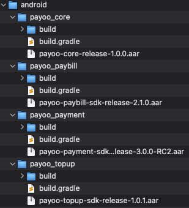
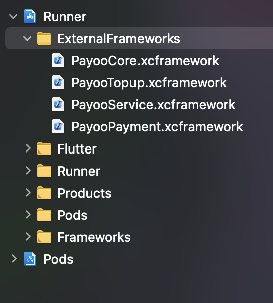
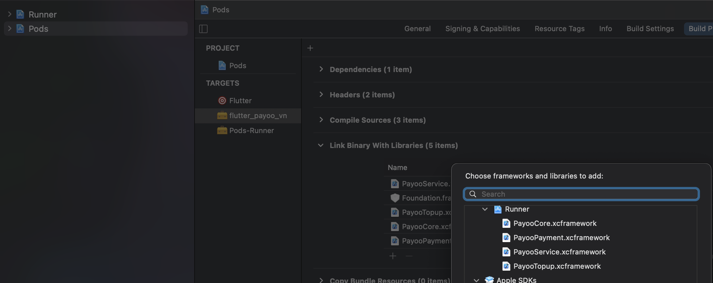

# flutter_payoo_vn

This plugin helps in integrating the [Payoo](https://payoo.vn) native mobile SDK into Flutter application project.
Currently, Payoo supports only Android & iOS platforms.
It is only a wrapper that helps a Flutter Application can interact with the Payoo native mobile SDK by using MethodChannel.
It does not contain any Payoo source code or SDK artifacts (.aar files on Android, and .framework files on iOS).

It is a present from Romantic Project. More from [Romantic Developer](https://pub.dev/publishers/romanticdeveloper.com/packages)

## Getting Started

First at all, before using this plugin, you need to make sure that your application has already been registered as a Payoo's merchant.
And you have the SDKs for Android (.aar files) & iOS (framework files).

### Setup for Android

#### Step 1: Create module by AAR file
- See https://developer.android.com/studio/projects/android-library#psd-add-aar-jar-dependency
- Currently, each of Payoo aar files is a module, named as image below:


#### Step 2: Set some configuration properties
- Add these properties into <your-root-project>/gradle.properties
```properties
payoo.vn.native.sdk.dir=<directory-contains-the-payoo-android-modules>
payoo.vn.protocol.scheme.dev=<your-protocol-scheme-for-development-env>
payoo.vn.protocol.scheme.prod=<your-protocol-scheme-for-production-env>
```

- Add below code into <your-flutter-project>/android/build.gradle
```groovy
buildscript {
    ext.kotlin_version = '1.3.50'
    repositories {
        google()
        jcenter()
        maven { url 'https://plugins.gradle.org/m2/' }
        mavenCentral()
    }

    dependencies {
        classpath 'com.android.tools.build:gradle:3.5.0'
        classpath "org.jetbrains.kotlin:kotlin-gradle-plugin:$kotlin_version"
    }
}

rootProject.allprojects {
    repositories {
        google()
        jcenter()
        maven { url 'https://jitpack.io' }
    }
}
```

- Add below code into <your-flutter-project>/android/app/build.gradle
```groovy
def globalProperties = new Properties()
def globalPropertiesFile = new File(rootProject.projectDir, "gradle.properties")
println "propertiesFile: ${globalPropertiesFile}"
if (globalPropertiesFile.exists()) {
    globalPropertiesFile.withReader('UTF-8') { reader ->
        globalProperties.load(reader)
    }
}
def payooSchemeDev = globalProperties.getProperty("payoo.vn.protocol.scheme.dev")
def payooSchemeProd = globalProperties.getProperty("payoo.vn.protocol.scheme.prod")
//TODO you can set the payoo protocol scheme matched with your app flavor.

android {
    compileSdkVersion 30

    defaultConfig {
        minSdkVersion 21
        targetSdkVersion 30
        resValue "string", "payoo_protocol_scheme", "${payooSchemeDev}"
    }
    lintOptions {
        disable 'InvalidPackage'
    }
    packagingOptions {
    }
}

dependencies {
    implementation project(':payoo_core')
    implementation project(':payoo_paybill')
    implementation project(':payoo_payment')
    implementation project(':payoo_topup')

    // These dependencies are required by Payoo.vn. If there are issues with this, please contact to Payoo coordinator.
    implementation "androidx.core:core-ktx:1.3.2"
    implementation 'androidx.appcompat:appcompat:1.3.0'
    implementation 'androidx.constraintlayout:constraintlayout:2.0.4'
    implementation 'androidx.recyclerview:recyclerview:1.2.1'
    implementation 'com.google.android.material:material:1.2.1'
    implementation 'com.squareup.retrofit2:retrofit:2.4.0'
    implementation 'com.squareup.retrofit2:converter-gson:2.4.0'
    implementation 'com.squareup.retrofit2:adapter-rxjava2:2.4.0'
    implementation 'androidx.lifecycle:lifecycle-livedata-ktx:2.2.0'
    implementation 'org.fabiomsr:moneytextview:1.1.0'
    implementation 'joda-time:joda-time:2.10.5'
    implementation 'com.github.barteksc:android-pdf-viewer:2.8.2'
    implementation 'com.github.zhukic:sectioned-recyclerview:1.2.3'
    implementation 'androidx.paging:paging-runtime-ktx:2.1.0'
    implementation 'com.github.wendux:DSBridge-Android:3.0.0'
    implementation(platform("com.squareup.okhttp3:okhttp-bom:4.9.0"))
    implementation("com.squareup.okhttp3:okhttp")
    implementation("com.squareup.okhttp3:logging-interceptor")
    implementation 'io.reactivex:rxkotlin:2.0.0-RC1'
    implementation "io.reactivex.rxjava2:rxjava:2.2.1"
    implementation 'io.reactivex.rxjava2:rxandroid:2.0.2'
}
```

- Enable MultipleDex as well. See [the docs here](https://developer.android.com/studio/build/multidex)

### Setup for iOS
Open <your-fluter-project>/ios/Runner.xcworkspace in XCode.

#### Step 1: Create ExternalFrameworks group for your target
- Create a new group for your Runner target, named as 'ExternalFrameworks' by adding all of framework files from Payoo. See [the docs here](https://developer.apple.com/documentation/xcode/creating-organizing-and-editing-source-files)
- After doing this, you will see as image below.


#### Step 2: Link ExternalFrameworks to flutter_payoo_vn target.
See [the docs here](https://developer.apple.com/library/archive/technotes/tn2435/_index.html)
- Choose Pods target at the left side panel.
- See the center panel, choose the TARGETS/flutter_payoo_vn.
- At tab Build Phases, below at Link Binary With Libraries item, click (+) button to link all of Payoo framework files. 


#### Step 3: Embed ExternalFrameworks to Runner target.
- Do the same above steps for Runner target.


#### Step 4: Add NSContactsUsageDescription
- Payoo need Contacts permission, on iOS, you need to add NSContactsUsageDescription into Info.plist. See [the docs here](https://developer.apple.com/documentation/contacts/requesting_authorization_to_access_contacts)

#### Step 5: Add NSAppTransportSecurity
- Also add NSAppTransportSecurity that helps the application could make HTTP connection on Development environment. See [the docs here](https://developer.apple.com/documentation/bundleresources/information_property_list/nsapptransportsecurity)

## Using in Flutter
```dart
import 'package:flutter/material.dart';
import 'package:flutter_payoo_vn/flutter_payoo_vn.dart';

void main() {
  runApp(MyApp());
}

class MyApp extends StatefulWidget {
  @override
  _MyAppState createState() => _MyAppState();
}

class _MyAppState extends State<MyApp> {
  @override
  void initState() {
    _initialize();
    super.initState();
  }

  @override
  Widget build(BuildContext context) {
    return MaterialApp(
      home: Scaffold(
        appBar: AppBar(
          title: const Text('Plugin example app'),
        ),
        body: Center(
          child: Column(
            children: [
              Text('This is Payoo'),
              ElevatedButton(
                  onPressed: () {
                    _navigate(PayooVnServiceIds.topup);
                  },
                  child: Text(PayooVnServiceIds.topup)),
              ElevatedButton(
                  onPressed: () {
                    _navigate(PayooVnServiceIds.electric);
                  },
                  child: Text(PayooVnServiceIds.electric)),
              ElevatedButton(
                  onPressed: () {
                    _navigate(PayooVnServiceIds.water);
                  },
                  child: Text(PayooVnServiceIds.water)),
            ],
          ),
        ),
      ),
    );
  }

  Future<dynamic> _navigate(String serviceId) async {
    final res = await PayooVnPlugin.navigate(serviceId);
    print('_MyAppState._navigate: $res');
  }

  void _initialize() async {
    final res = await PayooVnPlugin.initialize(PayooVnSettings(
        isDev: true,
        merchantId: "your-merchant-id",
        secretKey: "your-merchant-secret-key"));
  }
}
```
